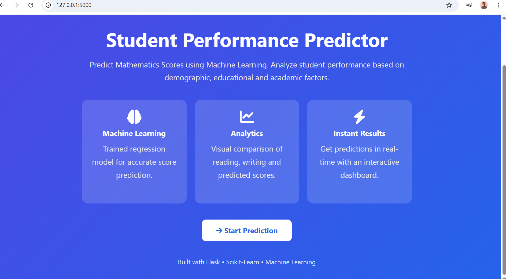
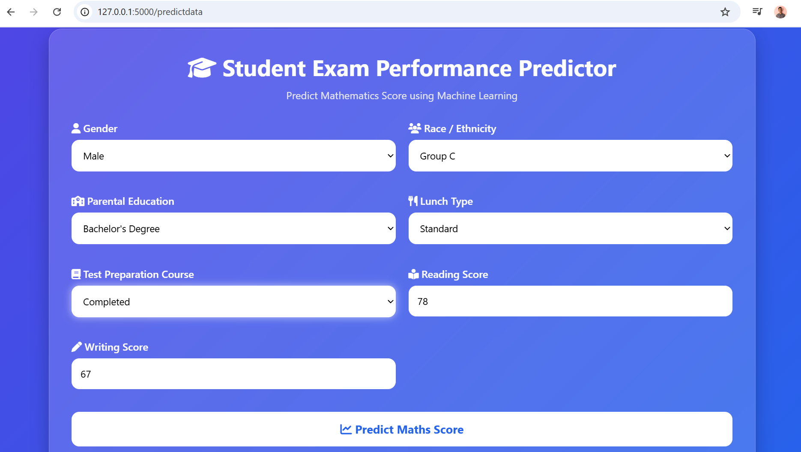
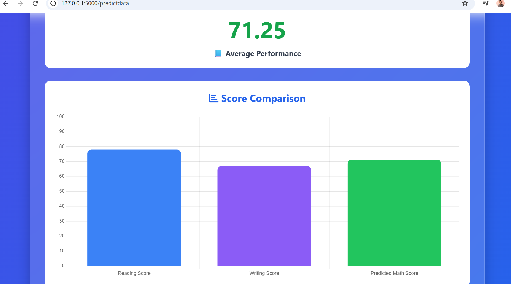

# 🎓 Student Performance Predictor

A Machine Learning web application that predicts a student's Mathematics score based on demographic and academic factors.

Built using Flask, Scikit-Learn, Pandas, NumPy, and Machine Learning Pipelines.

---

## 🚀 Features

- Predict Mathematics Score using Machine Learning
- Interactive and Responsive User Interface
- End-to-End ML Pipeline
- Data Preprocessing Pipeline
- Model Serialization using Pickle
- Exception Handling and Logging
- Real-Time Prediction
- Score Comparison Visualization using Chart.js
- Performance Classification

---

## 🛠️ Tech Stack

### Machine Learning
- Python
- Scikit-Learn
- Pandas
- NumPy
- CatBoost
- XGBoost

### Backend
- Flask

### Frontend
- HTML
- CSS
- JavaScript
- Chart.js
- Font Awesome

---

## 📂 Project Structure

```text
Student-Performance-Predictor/
│
├── app.py
├── README.md
├── requirements.txt
├── setup.py
├── .gitignore
│
├── artifacts/
│   ├── data.csv
│   ├── train.csv
│   ├── test.csv
│   ├── model.pkl
│   └── preprocessor.pkl
│
├── notebook/
│   ├── 1. EDA STUDENT PERFORMANCE.ipynb
│   ├── 2. MODEL TRAINING.ipynb
│   └── data/
│       └── stud.csv
│
├── src/
│   ├── exception.py
│   ├── logger.py
│   ├── utils.py
│   │
│   ├── components/
│   │   ├── data_ingestion.py
│   │   ├── data_transformation.py
│   │   └── model_trainer.py
│   │
│   └── pipeline/
│       ├── train_pipeline.py
│       └── predict_pipeline.py
│
├── templates/
│   ├── index.html
│   └── home.html
│
├── images/
│   ├── home_page.png
│   ├── prediction_page.png
│   └── result_page.png
│
└── logs/
```

---

## 📊 Machine Learning Workflow

### 1. Data Ingestion
- Read dataset
- Split train and test data
- Store artifacts

### 2. Data Transformation
- Handle missing values
- Encode categorical features
- Scale numerical features
- Create preprocessing pipeline

### 3. Model Training
The following models were evaluated:

- Linear Regression
- Decision Tree Regressor
- Random Forest Regressor
- Gradient Boosting Regressor
- CatBoost Regressor
- XGBoost Regressor

The best-performing model is automatically selected and saved.

### 4. Prediction Pipeline
- Load trained model
- Load preprocessor
- Transform user input
- Generate prediction

---

## ⚙️ Installation

### Clone Repository

```bash
git clone https://github.com/niraj-codes01/student-performance-predictor.git
```

### Move to Project Directory

```bash
cd student-performance-predictor
```

### Create Virtual Environment

```bash
conda create -n mlproject python=3.11 -y
conda activate mlproject
```

### Install Dependencies

```bash
pip install -r requirements.txt
```

---

## ▶️ Run Application

```bash
python app.py
```

Open your browser and visit:

```text
http://127.0.0.1:5000
```

---

## 📈 Sample Prediction

### Input

| Feature | Value |
|----------|---------|
| Gender | Male |
| Race/Ethnicity | Group C |
| Parental Education | High School |
| Lunch | Standard |
| Test Preparation | Completed |
| Reading Score | 78 |
| Writing Score | 68 |

### Output

```text
Predicted Mathematics Score = 74.52
```

---

## 📸 Screenshots

### Home Page



### Prediction Page



### Result Page



---

## 🌐 Application Overview

This application allows users to:

- Enter student details
- Submit academic information
- Predict mathematics score instantly
- Visualize score comparisons
- View performance category

---

## 🔮 Future Improvements

- Docker Deployment
- AWS EC2 Deployment
- AWS Elastic Beanstalk Deployment
- MLflow Integration
- Model Monitoring
- Explainable AI (SHAP)
- User Authentication
- Prediction History Dashboard

---

## 📚 Key Concepts Used

- Object-Oriented Programming (OOP)
- Machine Learning Pipelines
- Feature Engineering
- Model Serialization
- Flask Web Development
- Exception Handling
- Logging
- Data Preprocessing
- Hyperparameter Tuning

---

## 👨‍💻 Author

**Niraj Pachpande**

Aspiring Machine Learning Engineer | Data Science Enthusiast

### Connect With Me

- GitHub: https://github.com/niraj-codes01
- LinkedIn: www.linkedin.com/in/niraj-codes01


---

## ⭐ If you found this project useful

Give this repository a star on GitHub and feel free to contribute.
